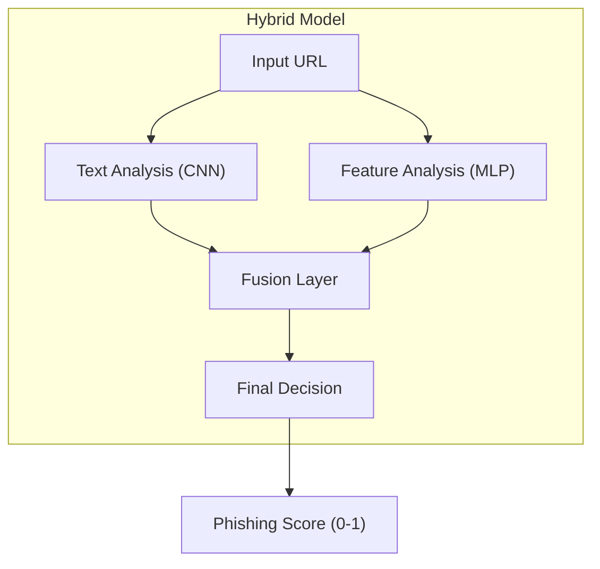

# Zero-day Phishing Detector (Hybrid Deep Learning)

A state-of-the-art phishing detection system powered by a **Hybrid Deep Learning Architecture**. This model fuses a **Convolutional Neural Network (CNN)** for raw text analysis with a **Multi-Layer Perceptron (MLP)** for engineered feature processing, achieving **99.23% accuracy** and a near-zero false positive rate.

## 🚀 Key Features

- **Hybrid Deep Learning Model**: Combines CNN (text patterns) + MLP (statistical features).
- **Dual-Input Analysis**:
  - **Text Branch**: Reads raw URLs to find semantic patterns (e.g., "secure-login").
  - **Feature Branch**: Analyzes 57 explicit features (length, entropy, DNS, etc.).
- **Superior Performance**: 99.23% Accuracy, 0.54% False Positive Rate.
- **Production Ready**: FastAPI-based REST API with real-time inference.
- **Web UI**: Clean, modern interface for testing URLs.

## 📊 Architecture

The system uses a dual-branch neural network to analyze URLs from two perspectives:



1.  **Text Analysis (CNN)**: Scans the raw URL string for suspicious keyword sequences and brand impersonation patterns.
2.  **Feature Analysis (MLP)**: Analyzes 57 engineered features (Lexical + Host-based) for statistical anomalies.

## 🔧 Quick Start

### 1. Installation

```bash
# Clone repository
git clone <repository-url>
cd url_phishing_detector

# Create virtual environment
python -m venv venv
source venv/bin/activate  # On Windows: venv\Scripts\activate

# Install dependencies
pip install -r requirements.txt
```

### 2. Train the Model

Train the Hybrid Deep Learning model using your dataset:

```bash
python train_hybrid_model.py kaggle.csv
```
*This will save the trained model to `models/hybrid_v1/`.*

### 3. Evaluate the Model

Evaluate the model's performance on a test dataset:

```bash
python evaluate_hybrid.py evaluation_test_data.csv
```

**Typical Output:**
- **Accuracy**: >99%
- **False Positive Rate**: <0.6%
- **Precision/Recall**: >99%

### 4. Start API Server

Start the REST API (loads Hybrid model by default):

```bash
python main.py
```

The API will be available at `http://localhost:8000`.

### 5. Use Web UI

Open `ui.html` in your browser to test URLs through the web interface.

## 🌐 API Endpoints

| Endpoint | Method | Description |
|----------|--------|-------------|
| `/predict` | POST | Predict single URL |
| `/batch_predict` | POST | Predict multiple URLs |
| `/health` | GET | Health check |

### Example Request

```bash
curl -X POST "http://localhost:8000/predict" \
  -H "Content-Type: application/json" \
  -d '{"url": "https://suspicious-login.com"}'
```

**Response:**
```json
{
  "url": "https://suspicious-login.com",
  "is_phishing": true,
  "phishing_score": 0.9998,
  "risk_level": "very_high",
  "prediction_source": "hybrid"
}
```

## 📈 Performance

The Hybrid Deep Learning model delivers state-of-the-art results:

| Metric | Performance |
| :--- | :--- |
| **Accuracy** | **99.23%** |
| **Precision** | **99.46%** |
| **Recall** | **99.00%** |
| **False Positive Rate** | **0.54%** |

**Why Hybrid?**
By combining text analysis with feature engineering, the model can detect sophisticated phishing attacks that might look statistically "normal" (evading feature-based models) or use obscure keywords (evading simple text models).

## 📁 Project Structure

```
url_phishing_detector/
├── main.py                          # API Entry Point
├── train_hybrid_model.py            # Hybrid Training Script
├── evaluate_hybrid.py               # Hybrid Evaluation Script
├── ui.html                          # Web Interface
├── src/phishing_detector/
│   ├── api.py                       # API Logic
│   ├── detector.py                  # Main Detector Class
│   ├── models/
│   │   └── hybrid_model.py          # Hybrid Architecture (CNN+MLP)
│   └── utils/
│       └── url_tokenizer.py         # URL Tokenizer for CNN
└── models/
    └── hybrid_v1/                   # Saved Hybrid Model
```

## 📄 License

MIT License

## 🙏 Acknowledgments

Built with **TensorFlow/Keras** and **FastAPI**.
